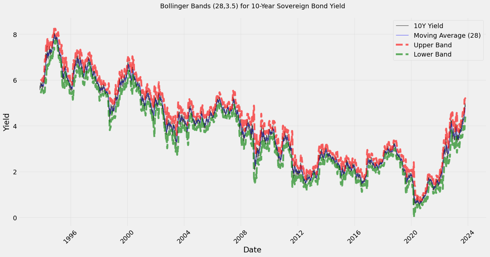
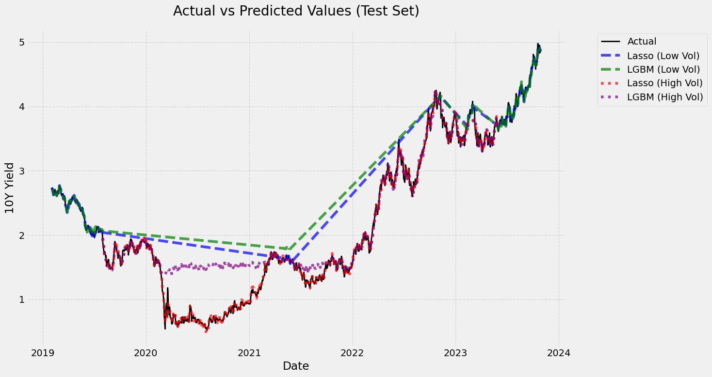

# Sovereign Bonds Analysis Strategy Project (FIN 554)

This repository contains the complete framework, data, and analysis for predicting sovereign 10-Year bond yields using advanced machine learning techniques. By integrating macroeconomic indicators and technical analysis, we explore whether Lasso regression and LightGBM models outperform traditional methods in different markets, including the U.S. and Australia.

---
## Team

<div align="center">

<p><strong>Yadvesh Yadav [Team Lead]</strong></p>
</div>

Email: [yyada@illinois.edu](mailto:yyada@illinois.edu)  
LinkedIn: [https://www.linkedin.com/in/yadvesh/](https://www.linkedin.com/in/yadvesh/)

As a Master's student in Financial Mathematics at the University of Illinois Urbana-Champaign, with a background as a Data Science Engineer, I specialize in financial data analysis, predictive modeling, and algorithmic trading. My passion lies in leveraging mathematical and computational techniques to develop innovative, quantitative trading strategies and solutions.

---

<div align="center">

<p><strong>Krish Desai</strong></p>
</div>

Email: [kcdesai2@illinois.edu](mailto:kcdesai2@illinois.edu)  
LinkedIn: [https://www.linkedin.com/in/krish-desai-4447971b3](https://www.linkedin.com/in/krish-desai-4447971b3/)

A highly motivated  individual with a strong academic background in financial mathematics and computer science. Eager to contribute technical expertise and contribute to innovative solutions. A quick learner with a strong work ethic and a collaborative spirit, always seeking a challenging problem in a dynamic environment.

---

<div align="center">

<p><strong>Gaurav Ghosh</strong></p>
</div>

Email: [gauravg4@illinois.edu](mailto:gauravg4@illinois.edu)  
LinkedIn: [https://www.linkedin.com/in/gauravg29/](https://www.linkedin.com/in/gauravg29/)

I am a Master's candidate in Finance at the University of Illinois Urbana-Champaign, with expertise in fixed-income analysis, portfolio risk monitoring, and financial modeling. A Chartered Financial Analyst Level II candidate, i possess advanced technical skills in Python, R, and Tableau with experience in regulatory compliance, auditing, and options trading. I am passionate about leveraging data-driven insights to enhance investment strategies and optimize portfolio performance under diverse market conditions.

---

<div align="center">

<p><strong>Ganesh Ashwin Vadari Venkata</strong></p>
</div>

Email: [gav3@illinois.edu](mailto:gav3@illinois.edu)  
LinkedIn: [https://www.linkedin.com/in/ganeshashwinvv/](https://www.linkedin.com/in/ganeshashwinvv/)

I am a Master's candidate in Financial Mathematics at the University of Illinois Urbana-Champaign, specializing in quantitative finance and advanced analytics for financial decision-making. With a Chartered Accountant certification and professional expertise in corporate development and financial advisory, I have optimized processes and delivered impactful results in valuation and strategic finance working with the CFO office at Cavinkare and complex accounting advisory branch at Grant Thornton.

---

## Project Overview

This research evaluates the predictive power of machine learning models—specifically Lasso and LightGBM—for forecasting sovereign bond yields. It incorporates diverse inputs, including:
- **Macroeconomic indicators:** CPI, PPI, Federal Funds Rate, Unemployment Rate.
- **Technical indicators:** Moving averages, RSI, MACD, Ichimoku Cloud.

Key focus areas include:
- **Preprocessing techniques:** Winsorizing, exponential smoothing.
- **Signal generation:** Combining machine learning outputs with Ichimoku Cloud indicators.
- **Regime detection:** Classifying high and low volatility market conditions using Hidden Markov Models (HMM).

This research builds upon existing bond pricing literature and extends it with modern ML frameworks.

---

## Research Foundations

### Key Influences
1. **Dubrov (2015):** Monte Carlo simulations for exotic bond pricing.
2. **Ganguli & Dunnmon (2017):** Corporate bond price prediction using regression and neural networks.
3. **Hanna (2016):** Predicting junk bond defaults with Random Forest models.

### Hypotheses
1. **Main Hypothesis:** Machine learning models can outperform traditional forecasting techniques for sovereign bonds.
2. **Secondary Hypothesis:** Preprocessing methods (e.g., feature selection, winsorizing) enhance model performance.
3. **Additional Hypotheses:**
   - Macroeconomic indicators improve prediction accuracy.
   - Momentum-based indicators like RSI, SMA, and Ichimoku Cloud enhance trading strategies.
   - Regime-specific strategies yield better results.

---

## Technical Implementation

### Data Integration Framework

The dataset spans decades of historical data:
- **U.S. Treasury Bonds:** CRSP data from 1993 to 2018.
- **Australian 10-Year Bonds:** Investing.com data from 1992 to 2023.

#### Data Sources
- **Macroeconomic indicators:** Federal Reserve Economic Data (FRED).
- **Technical indicators:** Derived from bond yield data using Python libraries like TA-Lib.

#### Data Preprocessing
- **Imputation:** Addressing missing values with KNN and expanding windows.
- **Outlier Treatment:** Winsorizing extreme outliers.
- **Normalization:** Standardizing features using Z-score.

#### Indicator Framework
1. **Macroeconomic Indicators:** CPI, PPI, Federal Funds Rate, 10-Year Minus 2-Year Spread.
2. **Technical Indicators:** SMA, EMA, RSI, MACD, Bollinger Bands, Ichimoku Cloud.





### Model Architecture

#### 1. **Lasso Regression**
- Implements an expanding window framework for dynamic feature selection.
- Identifies stable features across different time periods.

#### 2. **LightGBM**
- Captures non-linear interactions between macroeconomic and technical variables.
- Uses grid search for parameter tuning.

#### Feature Validation Example
```python
def validate_features(df, features, window_size):
    results = {}
    for feature in features:
        # Granger causality and cointegration testing
        gc_result = granger_causality_test(df[['yield', feature]], maxlag=window_size)
        ...
        results[feature] = {'granger_p_value': gc_result['p_value']}
    return results
```

### Regime Detection and Signal Generation

#### Hidden Markov Models (HMM)
- Classifies market conditions into **low** and **high volatility** regimes.
- Incorporates rolling volatility as a key feature.


#### Signal Generation
Using Ichimoku Cloud components:
1. **Bullish Signal:** Tenkan-sen crosses above Kijun-sen, predicted price above Senkou Spans.
2. **Bearish Signal:** Tenkan-sen crosses below Kijun-sen, predicted price below Senkou Spans.


---

## Performance Analysis

### U.S. Market Results
- **Lasso:**
  - Overall MSE: 0.0015.
  - Low Volatility MSE: 0.0010.
  - High Volatility MSE: 0.0016.
- **Signal Statistics:**
  - Precision: 0.5000, Recall: 0.7500, F1 Score: 0.6000.

### Ichimoku Cloud Insights
- 31 signals generated:
  - **Buy Signals:** 24.
  - **Sell Signals:** 7.



---

## Market Extensions

### Australian Market Results
- **Directional Accuracy:** 0.5484.
- **Precision:** 0.5600, **Recall:** 0.8235, **F1 Score:** 0.6667.
- Demonstrates the potential for geographical scalability of the model.


### Challenges and Observations
- Signals in high volatility regimes showed lower accuracy.
- Further tuning is required to adapt to country-specific market dynamics.

---

## Future Development

1. **Parameter Optimization:** Advanced techniques for Ichimoku Cloud components.
2. **Regime-Specific Models:** Enhancing feature selection for low and high volatility periods.
3. **Alternative Data:** Incorporating sentiment analysis and alternative datasets.
4. **Cross-Market Analysis:** Expanding to additional sovereign bond markets.

---

## Usage

### Prerequisites
- **Python Version:** 3.7+
- **Key Libraries:**
  - `pandas`, `numpy`, `scikit-learn`, `lightgbm`, `hmmlearn`

---

## Acknowledgments

This research was conducted as part of the **FIN 554 Course** at the University of Illinois Urbana-Champaign. Special thanks to **Prof. Peterson** for his consistent support and mentorship.

---

